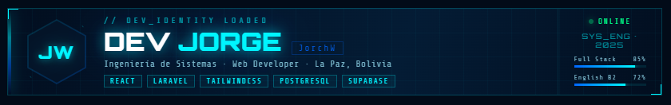

  

## Hi, I’m Jorge (JorchW)

Soy egresado en Ingeniería de Sistemas con experiencia en programación y desarrollo web. Me apasiona aprender nuevas tecnologías y aplicar soluciones que mejoren la experiencia de los usuarios.

## Sobre mí
- Experiencia en desarrollo web con **Bootstrap, Laravel y PostgreSQL**.  
- Interés en proyectos que combinen tecnología con la optimización de procesos.  
- Motivado por crecer profesionalmente en entornos dinámicos y colaborativos.  

## Habilidades
- **Lenguajes de programación**: Java, JavaScript, PHP
- **Frameworks**: Laravel, Bootstrap, TailWind CSS, React JS
- **Bases de datos**: PostgreSQL, MySQL
- **Cloud y despliegue**: RailWay, Supabase
- **Control de versiones**: GitHub, Gitlab
- **Nivel de Ingles**: B2
- **Pasatiempos**: Aprender más sobre tecnología, Gamer, Música, etc.

## Proyectos
### Portfolio Web Personal
Mi sitio web personal donde sabras mas cosas sobre mi persona. 
**Tecnologías**: ReactJs, Tailwind

## Proyectos Contribuidos
### Directorio Exportador
Sistema para promocionar productos hechos en Bolivia.  
**Tecnologías**: Laravel, Bootstrap, PostgreSQL
**Rol**: Developer

## Experiencia
### Practicas en el área de Sistemas - SENAVEX, La Paz, Bolivia (Abril 2024 – Noviembre 2024)
- Actualización y mantenimiento de la página institucional con Bootstrap, Laravel y PostgreSQL, mejorando la comunicación y el acceso a la información.  
- Implementación de cambios en la web institucional que facilitaron la gestión de contenidos y la experiencia de los usuarios internos.

### Propia
- Con el tiempo aprendi a manejar frameworks como Reactjs, TailwindCss, Materialize, aplicaciones de servicio de cloud y despliegue como RailWay y Supabase.

## Educación
- **Ingeniería de Sistemas** – UTB (Universidad Tecnológica Boliviana), La Paz, Bolivia (Egresado 2025)  

## Contacto
- **Correo**: [Jorgejwcn27_27@hotmail.com](mailto:Jorgejwcn27_27@hotmail.com)
- **WhatsApp**: [WhatsApp](https://wa.me/59162539291)
- **Portafolio**: [devjorgev.vercel.app](https://devjorgev.vercel.app/)

## Estadísticas Github

---
✨ Gracias por visitar mi perfil. Estoy abierto a colaborar en proyectos que representen un reto, una oportunidad de aprendizaje o simplemete hablar sobre tecnología y juegos.
